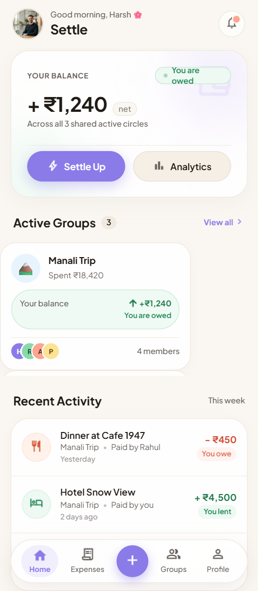
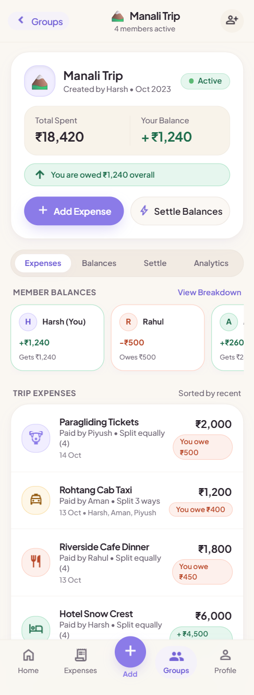
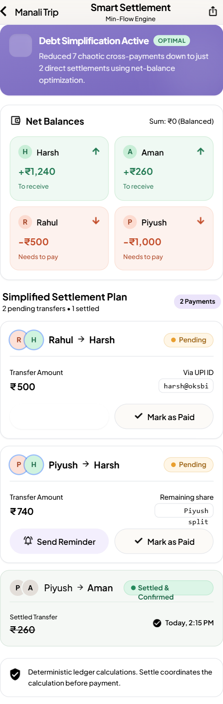
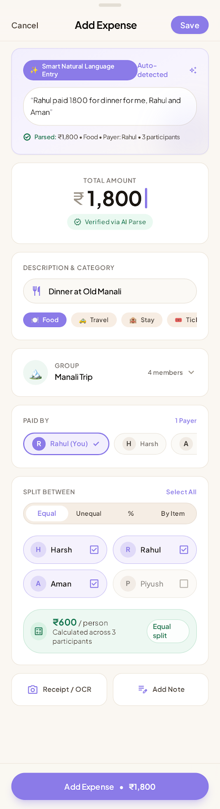

<p align="center">
  
</p>

# Papper Cutter — Mobile Android Application

[](android-app/)
[](#-generating-the-android-apk)
[](https://react.dev)
[](../design-files/stitch_app_concept_studio/warm_pastel_harmony/DESIGN.md)
[](../crates/papper-cutter-mobile/)

**Papper Cutter** is a native mobile-first Android application designed with the **Warm Pastel Harmony** aesthetic, strict integer minor-units arithmetic, and an automated min-flow debt settlement engine.

This directory contains the **React 19 + TypeScript** mobile client, packaged for Android deployment via **Capacitor 6** and Gradle. A companion 100% native Rust client built on **Dioxus 0.6 NDK** is available in [`crates/papper-cutter-mobile`](../crates/papper-cutter-mobile).

---

## 📱 Mobile Screenshots

<p align="center">
  
  
  
  
</p>

---

## 🛠️ Mobile Architecture & Tech Stack

- **Mobile Host**: Capacitor 6 (Native Android Web Activity with Hardware Access)
- **UI Framework**: React 19 + TypeScript
- **Bundler & Tooling**: Vite 8 + Oxlint
- **Design Tokens**: Warm Pastel Harmony (Cozy Canvas `#FAF7F2`, Gentle Lavender `#8B7BE8`, Sage Matcha `#1A6B4B`)
- **Native Android Integrations**:
  - Direct UPI intent dispatching (`android.intent.action.VIEW` for GPay, PhonePe, Paytm, BHIM)
  - Haptic feedback on expense submission and settlement
  - Native Android status bar & gesture navigation styling
  - Offline-ready SQLite/Preferences local storage

---

## 📁 Source Code Structure

```text
android-app/
├── src/
│   ├── domain/               # Pure financial business logic (mirrors Rust crate)
│   │   ├── money.ts         # Money class in minor units (paise) with Indian notation
│   │   ├── split.ts         # Deterministic remainder equal & percentage splits
│   │   ├── balance.ts       # Group net balance calculation
│   │   ├── settlement.ts    # Min-flow greedy settlement matching & UPI links
│   │   └── types.ts         # User, Group, Expense, Category models
│   ├── state/
│   │   ├── sampleData.ts    # Seed data (Manali Trip, Room 304, College Fest)
│   │   ├── AppContext.tsx   # Reactive state provider
│   │   └── useApp.ts        # Custom hook for context
│   ├── components/
│   │   ├── layout/          # Android device shell, StatusBar, BottomNavBar
│   │   ├── home/            # Balance cushion, group carousel, recent feed
│   │   ├── group/           # Group pulse header, expenses, balances, settle, analytics, members
│   │   ├── expense/         # AI natural language entry sheet & all expenses list
│   │   └── profile/         # User profile, UPI ID, app preferences
│   ├── index.css            # Design tokens & responsive mobile frame
│   ├── App.tsx              # Main controller
│   └── main.tsx             # React DOM entry point
├── package.json
└── vite.config.ts
```

---

## 🚀 Running Locally (Development Server)

```bash
# 1. Install dependencies
npm install

# 2. Run local dev server with hot module reloading
npm run dev
```

Open `http://localhost:5173` in your browser.  
*(Press `F12` → Toggle Device Toolbar to inspect in phone view: Pixel 7 or iPhone 14).*

### Verification Commands

```bash
npm run lint    # Oxlint high-speed linting
npm run build   # TypeScript typecheck + production Vite bundle
npm run preview # Preview the production build locally
```

---

## 📦 Generating the Android APK (Step-by-Step)

To compile a standalone Android APK (`.apk`) or Google Play App Bundle (`.aab`):

### Prerequisites
1. **Android Studio** (Hedgehog 2023.1.1 or newer) with Android SDK (API 34+)
2. **Java JDK 17 or 21**
3. **Node.js 18+**

### Step 1: Build the Production Web Bundle
```bash
npm run build
```

### Step 2: Initialize the Native Android Platform (One-Time)
```bash
# Add Capacitor Android wrapper (if not already initialized)
npx cap add android
```

### Step 3: Sync Assets and Native Plugins
Whenever you make changes to frontend code, re-sync to the Android project:
```bash
npm run build
npx cap sync android
```

### Step 4: Build Debug APK via Gradle (Headless)
You can build the `.apk` directly from your command line without opening Android Studio:
```bash
cd android
./gradlew assembleDebug      # Windows PowerShell: .\gradlew.bat assembleDebug
```

The output debug APK will be generated at:
```text
android-app/android/app/build/outputs/apk/debug/app-debug.apk
```

### Step 5: Install APK Directly to Connected Phone
```bash
# Via ADB:
adb install app/build/outputs/apk/debug/app-debug.apk

# Or via Capacitor CLI:
cd ..
npx cap run android
```

### Step 6: Build Signed Production Release APK / AAB
Open the project in Android Studio to configure release keystores:
```bash
npx cap open android
```
In Android Studio:
- Select **Build** → **Generate Signed Bundle / APK...**
- Choose **Android App Bundle** (for Google Play) or **APK** (for direct distribution).
- Select your release signing keystore and build!

---

## 🦀 Alternative: Pure Rust Dioxus Android APK

If you prefer a 100% native Rust binary compiled with zero webviews via the Android NDK, check out the companion client:

```bash
# From workspace root:
cd ../crates/papper-cutter-mobile
dx build --platform android --release
```
See [`crates/papper-cutter-mobile/README.md`](../crates/papper-cutter-mobile) for complete NDK instructions.

---

<p align="center">
  
  <br />
  <sub>Papper Cutter — Android Mobile Application</sub>
</p>
